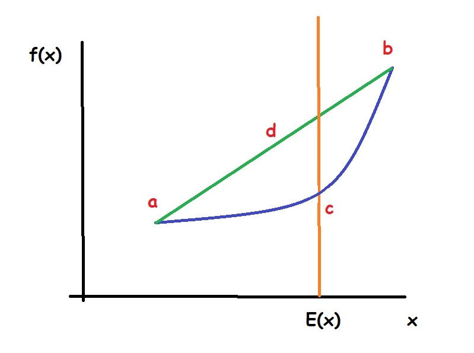

      

***

# Jensen’s Inequality and The Biasedness of Standard Deviation

**Be sceptical of your conclusion**

*Posted on July 2023*

***

Let me begin by explaining that all calculation of parameters of data are only estimations of the true parameters of the process [you can read this article if you are confused about this part](https://prakhosha.github.io/A-Story-on-Statistics/)

## Estimation

Estimation in statistics is such a huge topic. At the time of the writing, I can not cover all of this in one article. Maybe I will write about estimation in another article. But do not worry, we only need to know about biasedness of estimator to go further.

Let’s say you want to know the central tendency of a real world process. Usually, when people try to guess the central tendency of a real world process they use the mean. Especially the one where we use bootstrap sampling by summing all data points and divide them by the number of the data. Well, this mean is not the only way to calculate the central tendency of a data. There are many ways, one of which would be the median.

Which one should we use then? The answer is depend. That is why the mean, the median, and all transformations in statistics are only estimators of the true process parameters in which we will never know. And because all transformations in statistics are only estimators, they can be wrong, or in another word there is a difference between the expected value of a parameter in our data and the true process. This is called bias, and it is defined mathematically as

$$E(\hat{\theta}) \neq \theta$$

With $\hat{\theta}$ as the parameter of the data and $\theta$ as the parameter of the true process.

The punchline is that the standard deviation, an estimator of deviation of distribution, is bias. Which means when we try to model a real world process and collect the data, our standard deviation of the data is different than the true standard deviation.

In my current knowledge, there are two ways to prove that standard deviation is a bias estimator. One which use manipulations of equations and another which use the infamous Jensen’s inequality. This article will explain the biasedness of standard deviation through the lens of Jensen’s inequality.

What is Jensen’s inequality? Well let me first explain about transformation.

## Transformation

In mathematics, a function is a mapping of numbers to another numbers. A function $f(x) = 2 + x$, with $x$ as real numbers, for example, is a function. Function can also be mapped to another function which can be called transformation. So, a function is just a subset of transformation.

In statistics (or everything that involve random variables), it is natural for us to want to know the parameter of a real world process such as the mean, the median, the variances, etc. We calculate those parameters using transformations.

In linear transformation, it is natural to believe that the parameter, let’s say the expectation, of the transformed function is the same as the transformed function of the parameter, in this case the expectation. Or in another word

 $$E(f(x)) = f(E(x))$$

But this is only true for linear transformation and not for non-linear transformation.

## Jensen’s Inequality

If the function of the non-linear transformation is continuous, then we have either a convex (upward curve) or concave (downward curve) transformation.

When we apply a convex or concave transformation to a random variable, the expectation of the transformed variable is always greater (in convex transformation) or lower (in concave transformation) than the transformed of the expectation the random variable.

$$E(f(x)) \ge f(E(x))$$

in convex transformation,

$$E(F(x)) \le f(E(x)),$$

in concave transformation.

This rule is called Jensen’s inequality. We can see why this is true by drawing.

Suppose $f(x)$ is a function of random variable and this function is a convex function as drawn as figure above. Also, suppose that all data points $x$ reside between point $a$ and point $b$. From this drawing, we can see that the expectation of $f(x)$, which shown as point $d$ is always greater than the function of expectation of $x$ as shown as point $c$. We can also do the same thing with a concave function.

Jensen’s inequality can be used to prove that standard deviation, even if we calculate it using the unbiased calculation of variance, will always be bias.

## Biasedness of Standard Deviation

For the sake of simpler article, I am just going to use the unbiased version of the variance. Basically, variance is also bias and there are ways to fix this bias using Bessel’s correction. But I am not going to talk about this in this article (maybe in another one).

The unbiased version of the variance is

$$\hat{\sigma}^2 = \frac{\sum_{} ^{} (Y_i - \hat{Y})^2}{n - 1}$$

With $Y_i$ as the data points, $\hat{Y}$ as the mean of the data points, and $n$ as the numbers of data points.

Standard deviation is defined as the square root of the variance. Because standard deviation is the square root of the variance, standard deviation is a concave transformation.

By using Jensen’s inequality of concave transformation and the assumption that the variance of the random variable is not 0 (if the variance is indeed 0 then the data points are all the same) we have

$$E(\sqrt{\hat{\sigma}^2}) < \sqrt{E(\hat{\sigma}^2)}$$

Thus we can conclude that standard deviation is a bias estimator.
